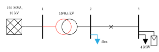

# cetz-power

[](https://github.com/langestefan/cetz-power/actions/workflows/tests.yml)
[](https://github.com/langestefan/cetz-power/actions/workflows/lint.yml)
[](https://github.com/langestefan/cetz-power/actions/workflows/docs.yml)
[](https://typst.app/)
[](LICENSE)

[](https://langestefan.github.io/cetz-power/)

**Power-system single-line diagrams in Typst, on top of [CeTZ](https://github.com/cetz-package/cetz).**

Draw single-line diagrams in Typst easily and quickly. Support for all basic components: buses, transformers, machines, loads, switchgear, PV, windings, connection points, and many more. 

> [!IMPORTANT]  
> We are constantly adding new symbols and features. If you have a symbol request, don't hesitate to [open an issue](https://github.com/langestefan/cetz-power/issues).

## Quick example

<p align="center">
  
</p>

```typst
#import "@preview/cetz-power:0.1.0": *

#diagram(length: 1.2cm, {
  let flex = rgb("#29abe2")
  bus("b1", (1.6, 0), length: 1.4, angle: 90deg, label: [1])
  bus("b2", (4.4, 0), length: 1.4, angle: 90deg, label: [2])
  bus("b3", (7.2, 0), length: 1.4, angle: 90deg, label: [3])
  external-grid("g", (0.6, 0), angle: 90deg,
    label: (content: align(center)[150 MVA, \ 10 kV],
            anchor: "north", distance: 0.25))
  wire("g.in", "b1.mid")
  transformer("t", "b1.mid", "b2.mid",
    primary-stroke: 0.8pt + red, label: [10/0.4 kV])
  wire("b2.mid", "b3.mid")
  breaker("q", (5.6, 0), kind: "cross")
  load("l2", bus-frac("b2", 1/6), elbow: 0.4,
    fill: flex, stroke: flex, label: (content: [flex], anchor: "east"))
  pv-panel("pv", bus-frac("b3", 0.3), elbow: 0.9)
  load("l3", bus-frac("b3", 1/6), elbow: 0.4, label: [4 MW])
})
```

## Installation

Via Typst Universe (recommended once published):

```typst
#import "@preview/cetz-power:0.1.0": *
```

Or locally by cloning the repo and importing from path:

```typst
#import "path/to/cetz-power/src/lib.typ": *
```

The wildcard form (`: *`) puts every symbol — `diagram`, `bus`, `transformer`, `wire`, … — directly in scope. If you'd rather keep them out of your top-level namespace, use `as pg` and write `pg.diagram(...)`, `pg.bus(...)` instead.

## Available symbols

| Category    | Symbols                                                                          |
|-------------|----------------------------------------------------------------------------------|
| Grid        | `bus`, `bus-frac`, `wire`, `elbow`, `junction`, `external-grid`, `transformer`, `transformer3` |
| Generation  | `machine`, `pv-panel`                                                            |
| Loads       | `load`                                                                           |
| Electrical  | `capacitor`, `resistor`, `inductor`, `diode`, `voltagesource`, `currentsource`, `ground`, `bolt` |
| Protection  | `switch`, `breaker` (square or `kind: "cross"`), `fuse`                          |
| Windings    | `delta`, `wye`, `zigzag`                                                         |
| Helpers     | `note`, `multi-wire`, `feeder`, `dali`                                           |

To add a symbol: drop a file under `src/symbols/<category>/`, wrap
`symbol()` from `src/core.typ`, export it from `src/lib.typ`.

## Design

- **Symbols have anchors.** Compass points, plus symbol-specific ones (`tap1..tapN`, `primary`/`secondary`, phase terminals).
- **One- or two-node placement.** One position + `angle:` drops a symbol in place; two positions orient it in→out with its own leads.
- **Cascading styles.** A global `set-style(cetz-power: (...))` changes defaults; per-family overrides live under e.g. `cetz-power.transformer`; per-call arguments override both.
- **Labels everywhere.** Every symbol accepts `label:` as a string, content, or `(content:, anchor:, distance:)` dict.

## Running the tests

```bash
tests/run.sh
```

Compiles every test file into `tests/<name>/out/*.svg` and (if reference images exist in `ref/`) does a rough diff.

## Building the docs

The docs are an [Astro Starlight](https://starlight.astro.build) site under `docs/`. Prose is MDX, Typst diagrams are standalone snippets under `docs/snippets/` (in category sub-folders) that get pre-compiled to SVG and embedded via a small `<Snippet>` component. Astro 6 requires Node ≥22.12.

```bash
cd docs
npm ci
npm run dev      # live preview at http://localhost:4321/cetz-power/
npm run build    # static site → docs/dist/
```

The deployed docs are built and pushed to GitHub Pages on every push to `main` by `.github/workflows/docs.yml`.

## Claude Code skills

`.claude/skills/` ships two [Claude Code](https://claude.com/claude-code) skills, picked up automatically when you open the repo:

- **`cetz-power-diagrams`** — drawing skills: symbol catalog, design rules, figure-replication workflow.
- **`oneline-diagram-annotator`** — digitises a raster one-line diagram into exact coordinates. First use:

  ```bash
  cd .claude/skills/oneline-diagram-annotator
  python3 -m venv .venv && .venv/bin/pip install -r requirements.txt
  ```

## License

MIT. See `LICENSE`.
